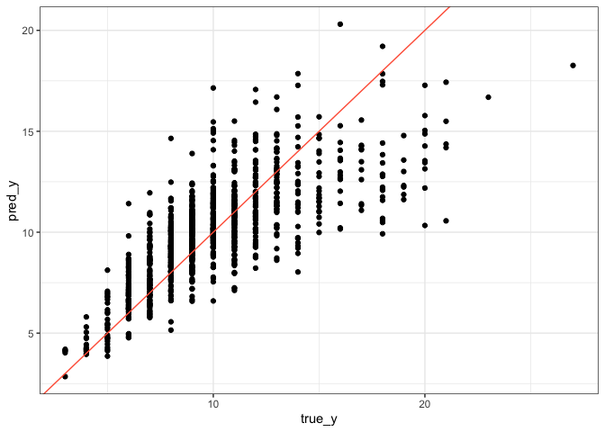

Regression Example: Abalone
================
2025-04-07

## Introduction

This document details the procedure to run the oblique BART and
axis-aligned BART on a regression task.

## Settings

Below, we load the
*abalone*\[<https://archive.ics.uci.edu/dataset/1/abalone>\] dataset.

``` r
data = read.csv("abalone.data", header = FALSE)

### process data ###

# remove rows with missing data
data = na.omit(data)

# identify the response
Y = data[, 9]

# split data into continuous and categorical data types
X_cont = data[, c(2:8)]
X_cat = data[, c(1)]

# scale continuous variables
my_scale <- function(x) return( scales::rescale(x, to = c(-.99, .99), from = range(x)) )
if (!is.null(names(X_cont))) {
  for (col in names(X_cont)) { X_cont[[col]] = my_scale(X_cont[[col]]) }
} else {
  X_cont = my_scale(X_cont) # handles case when there is only one continuous variable
}

# factor categorical variables
if (!is.null(names(X_cat))) {
  for (col in names(X_cat)) { X_cat[[col]] = as.numeric(factor(X_cat[[col]])) - 1 }
} else {
  X_cat = as.numeric(factor(X_cat)) - 1 # handles case when there is only one categorical variable
}

# create list of category levels
cat_level_list = list()
if (!is.null(names(X_cat))) {
  for (col in 1:length(names(X_cat))) { cat_level_list[[col]] = seq(0, length(unique(X_cat[, col])) - 1) }
} else {
  cat_level_list[[1]] = seq(0, length(unique(X_cat)) - 1) # handles case when there is only one categorical variable
}

# create 20 random test splits with 25% of the observations, rounded up
test_split_list = replicate(20, sample(seq(1, nrow(data)), size = ceiling(nrow(data) / 4), replace = FALSE), simplify = FALSE)

# convert to matrix
X_cont = data.matrix(X_cont)
X_cat = data.matrix(X_cat)
```

We have loaded the data, scaled the predictors, and created 20 sets of
training and testing partitions. Let us continue with just one
partition.

``` r
Y_train = Y[-test_split_list[[1]]]
X_cont_train = X_cont[-test_split_list[[1]], ]

# test split
Y_test = Y[test_split_list[[1]]]
X_cont_test = X_cont[test_split_list[[1]], ]

# handling categorical data
if (!is.null(cat_level_list)){
  # some data sets only have one categorical variable
  # but rffbart and flexbart require a matrix input
  if ((ncol(X_cat) > 1)){
    X_cat_train = X_cat[-test_split_list[[1]], ]
    X_cat_test = X_cat[test_split_list[[1]], ]
  } else if (nrow(X_cat) > 1) {
    X_cat_train = matrix(X_cat[-test_split_list[[1]], ], ncol = 1)
    X_cat_test = matrix(X_cat[test_split_list[[1]], ], ncol = 1)
  } else if (nrow(X_cat == 1)){
    X_cat_train = matrix(0L, nrow = 1, ncol = 1)
    X_cat_test = matrix(0L, nrow = 1, ncol = 1)
  }
} else {
  X_cat_train = matrix(0L, nrow = 1, ncol = 1)
  X_cat_test = matrix(0L, nrow = 1, ncol = 1)
}


# fit obliqueBART on training data
fit <- obliqueBART::obliqueBART_lp(
        Y_train = Y_train,
        X_cont_train = X_cont_train,
        X_cat_train = X_cat_train,
        cat_levels_list = cat_level_list,
        X_cont_test = X_cont_test,
        X_cat_test = X_cat_test,
        phi_option = 7,
      )
```

    ## n_train = 3132 n_test = 1045 p_cont = 7  p_cat = 1
    ##   MCMC Iteration: 0 of 2000; Warmup
    ##   MCMC Iteration: 200 of 2000; Warmup
    ##   MCMC Iteration: 400 of 2000; Warmup
    ##   MCMC Iteration: 600 of 2000; Warmup
    ##   MCMC Iteration: 800 of 2000; Warmup
    ##   MCMC Iteration: 1000 of 2000; Sampling
    ##   MCMC Iteration: 1200 of 2000; Sampling
    ##   MCMC Iteration: 1400 of 2000; Sampling
    ##   MCMC Iteration: 1600 of 2000; Sampling
    ##   MCMC Iteration: 1800 of 2000; Sampling

``` r
# report results
rmse_train = MLmetrics::RMSE(Y_train, fit$yhat.train.mean)
rmse_train
```

    ## [1] 1.945311

``` r
rmse_test = MLmetrics::RMSE(Y_test, fit$yhat.test.mean)
rmse_test
```

    ## [1] 2.152072

``` r
predictions_df <- tibble(true_y = Y_test,
                         pred_y = fit$yhat.test.mean)
ggplot(predictions_df, mapping = aes(x = true_y,
                                     y = pred_y)) +
  geom_point() + 
  geom_abline(intercept = 0, slope = 1, color = "tomato") +
  theme_bw()
```

<!-- -->
